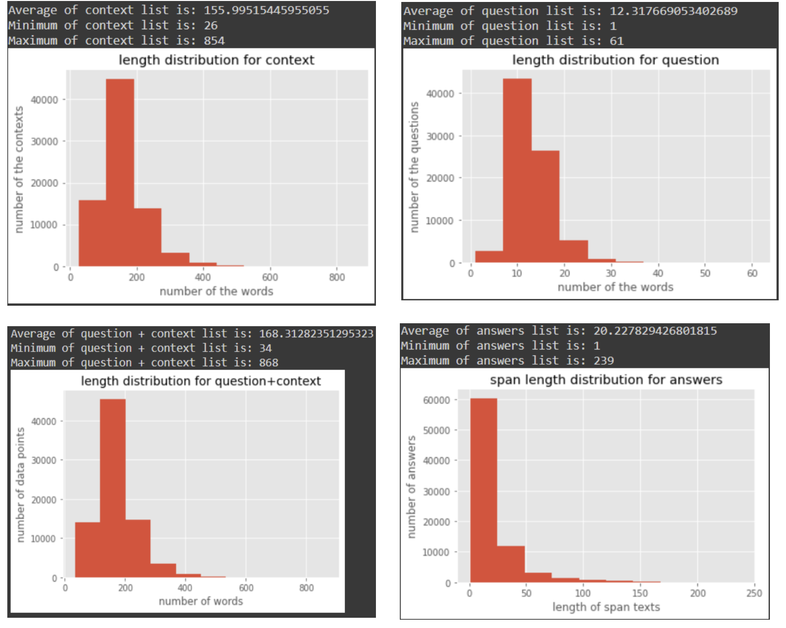
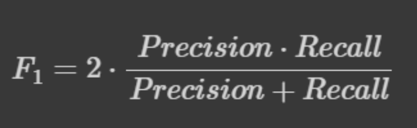

# Question and Answering on SQUAD dataset
This document is a summary of the works and steps we took to build a question-and-answer system. In this project, we used the database (SQUAD), which is a rich collection of content on the Wikipedia website, and we will explain more about it later. The implementation steps of this program are executed in the Google Collab environment and all the codes will be compatible with this system for sure. Also, the files related to the database can be downloaded separately from the original website. The model bellow is implemented on version 2.0.

## Loading the Dataset:
### A. Reading the Dataset:
SQUAD data set is ready in .json Format. Data set consist of 442 different articles. Every article divides into different paragraph and for every paragraph we may have one or multiple question and their answer. We use 90% of data set for training and 10% for validation. We make 3 different list:
#### Context List: which we put paragraph content into it.
#### Question List: For every paragraph there is one or multiple question. We put questions into this list. (For every question for context we repeat the same context in previous list)
#### Answers List: same as question list but this time we just put answers into list. Every element of this list is a dictionary consist of 3 keys named: answer_start which is a int that show start answer position in the text and text which is content of answer in string.
Next step is to find answer spin in the context. In our data set we already have Start-Answer index position. So, for finding end position of answer, we use answer_end function.
#### ANSWER_END Function:
In this function we want to add end position of answer into Answer list as another key into dictionary list of answers.
### B. Tokenizing
For Tokenizing our data set we Use BertTokenizerFast method of transformers Library. For these purposes we use BERT base model (Uncased). This model is uncased: it does not make a difference between english and English.
#### BERT MODEL: BERT is a transformers model pretrained on a large corpus of English data in a self-supervised fashion. This means it was pretrained on the raw texts only, with no humans labelling them in any way (which is why it can use lots
  
of publicly available data) with an automatic process to generate inputs and labels from those texts.
This tokenizer as input takes a sentence and as output give a diction consist of 3 keys:
1. Input_ids: Consist of Tokenizing (splitting strings in sub-word token strings),
converting tokens strings to ids and back, and encoding/decoding (i.e.,
tokenizing and converting to integers) 
2. Attention_mask
3. token_type_ids
######
The purpose of this function is to find position of our start and end Answer in our tokenizer. For this purpose, we use char_to_token method of BertTokenizerFast library to convert our start position word to its corresponded token into tokenizer. For example:
Our first context is: 
######
Architecturally, the school has a Catholic character. Atop the Main Building's gold dome is a golden statue of the Virgin Mary. Immediately in front of the Main Building and facing it, is a copper statue of Christ with arms upraised with the legend "Venite Ad Me Omnes". Next to the Main Building is the Basilica of the Sacred Heart. Immediately behind the basilica is the Grotto, a Marian place of prayer and reflection. It is a replica of the grotto at Lourdes, France where the Virgin Mary reputedly appeared to Saint Bernadette Soubirous in 1858. At the end of the main drive (and in a direct line that connects through 3 statues and the Gold Dome), is a simple, modern stone statue of Mary.
######
It’s corresponding tokens is : 
######
[101, 6549, 2135, 1010, 1996, 2082, 2038, 1037, 3234, 2839, 1012, 10234, 1996, 2364, 2311, 1005, 1055, 2751, 8514, 2003, 1037, 3585, 6231, 1997, 1996, 6261, 2984, 1012, 3202, 1999, 2392, 1997, 1996, 2364, 2311, 1998, 5307, 2009, 1010, 2003, 1037, 6967, 6231, 1997, 4828, 2007, 2608, 2039, 14995, 6924, 2007, 1996, 5722, 1000, 2310, 3490, 2618, 4748, 2033, 18168, 5267, 1000, 1012, 2279, 2000, 1996, 2364, 2311, 2003, 1996, 13546, 1997, 1996, 6730, 2540, 1012, 3202, 2369, 1996, 13546, 2003, 1996, 24665, 23052, 1010, 1037, 14042, 2173, 1997, 7083, 1998, 9185, 1012, 2009, 2003, 1037, 15059, 1997, 1996, 24665, 23052, 2012, 10223, 26371, 1010, 2605, 2073, 1996, 6261, 2984, 22353, 2135, 2596, 2000, 3002, 16595, 9648, 4674, 2061, 12083, 9711, 2271, 1999, 8517, 1012, 2012, 1996, 2203, 1997, 1996, 2364, 3298, 1006, 1998, 1999, 1037, 3622, 2240, 2008, 8539, 2083, 1017, 11342, 1998, 1996, 2751, 8514, 1007, 1010, 2003, 1037, 3722, 1010, 2715, 2962, 6231, 1997, 2984, 1012, 102]
######
- Answers Start Tokens: in the original context starting answer index is 512 but its corresponding token in the tokenizer is 43.
- End Start Token: Same as the Answer start.
We use same function for Validation set. In this case we do not need start position and end position. This is the only difference between validation and train set.

### Data Analyse
As we could see in the charts bellow, in our dataset, the maximum length of the context is 854 which is bigger than what we expected but the average of them is 155. Next, we compute the average of the questions and answers. These calculations, could be important for us, for example for the answers list, could serve as a threshold for determine answerability.

### Data Normalization
In this different function to normalize our data set.
1. remove_Article function for removing articles from text. 
2. space_fix function to fixing some unwanted spaces in text. 
3. remove_punc for removing punctuation marks from text. 
4. Lower function to lower case every word in text.

### Evaluation Methods
In this project we use 2 different methods for evaluation: 
1. Exact match
2. F1 Score
#### Exact Match
In this function we compare prediction answer with the original answer. If they are same its going to return 1 other wise 0.
F1 Score:
- In this function we compute F1 Score for our predicted answer. F1 Score define as:

For computing this score we use Counter method of collection library.
We find every same word that happen in both real answer and predicted answer using this method which are our True Positive in this case.

Length of our predicted answer is True Positive + False Positive.

Length of our real answer is True Positive + False Negative

### BERT:
Here we use our tokenizer to tokenize our context and questions for our data set and answer for our validation set.

We give both train_contexts and train_question as input to tokenizer to concatenate them together. By setting truncation to True truncate sequences to a maximum length specified by the max_length argument.

We define two classes named SquadDataset and SquadDataset_Validation for reading our data from our encoded train set and validation set. For this purposes we use torch.utils.data.Dataset library as super classes and defining its __getitem__ method and __len__ method. There is little different between these two classes that related to validation dataset. In validation data set we add real answer corresponding to its context as ‘gold_text’ into it.

Here we define a evaluate function to evaluate our predicted start and end position of answer. For this purpose, we give both our data set and model to the function. Using model.get_score method we get score for both start and end position. Then using these two predicted positions we extract our predicted answer throw context. Now we can compute Exact Match score and F1 Score using defined function.

In this function we use two specific method named model.eval and model.no_grad methods:

model.eval() will notify all your layers that you are in eval mode, that way, batch norm or dropout layers will work in eval mode instead of training mode.

torch.no_grad() impacts the auto grad engine and deactivate it. It will reduce memory usage and speed up computations, but you will not be able to backprop (which you don’t want in an eval script).
  
### Defining Model:
In this point we define our Model. We are using BertModel and BertPreTrainedModel from transformers library. We define our Bert_QA class inheriting from BertPreTrainedModel as super class.

In __unit__ method of our class we define 3 different layers.
Self.bert which is our BertModel taking config from BertPreTrainedModel as argument. Then we define a Linear layer for linear transformation of our Bert model output to 2 features. Finally, we define a criterion layer with CrossEntropyLoss function for our model.

Our model has two function names forward and get_scoe which will be explained in training phase.

### Training Model
We define our model from Bert_QA class. Using SquadDataset class that we define we read our train set then using DataLoader method of torch.utils.data library we shuffle our train set and set our batch size to 14.

We define our optimization as AdamW which takes it parameter from pre trained uncased Bert model. The AdamW optimizer decouples the weight decay from the optimization step. This means that the weight decay and learning rate can be optimized separately, i.e., changing the learning rate does not change the optimal weight decay. We set learning rate to 3e-5. 

We set epoch to 3:

Using Data loader, we take our batch of data into model.

We use optim. zero_grad() to sets the gradients of all optimized torch.Tensor s to zero. Then by extracting information from our data we train our model.
- loss.backward() computes dloss/dx for every parameter x which has requires_grad=True . 

These are accumulated into x.grad for every parameter x.
- optim.step() is performs a parameter update based on the current gradient (stored in . grad attribute of a parameter) and the update rule. ... backward () multiple times accumulates the gradient (by addition) for each parameter.
### RESULT
In this section we represent our model result on Validation Set:

- Exact Match = 57.55 
- F1 Score = 72.48
We use a function name Online Predict to predict answers for our data.

As example our models answers to some questions:

**context:** Rome's diplomatic agreement with her neighbours of Latium confirmed the Latin league and brought the cult of Diana from Aricia to the Aventine. and established on the Aventine in the "commune Latinorum Dianae templum": At about the same time, the temple of Jupiter Latiaris was built on the Alban mount, its stylistic resemblance to the new Capitoline temple pointing to Rome's inclusive hegemony. Rome's affinity to the Latins allowed two Latin cults within the pomoerium: and the cult to Hercules at the ara maxima in the Forum Boarium was established through commercial connections with Tibur. and the Tusculan cult of Castor as the patron of cavalry found a home close to the Forum Romanum: Juno Sospita and Juno Regina were brought from Italy, and Fortuna Primigenia from Praeneste. In 217, Venus was brought from Sicily and installed in a temple on the Capitoline hill.
**question:** From where was Venus brought and lodged on the Capitoline Hill? 
- gold answer: Sicily
- bert answer: sicily

**context:** During April 2009, U.S. Federal Reserve vice-chair Janet Yellen discussed these paradoxes: "Once this massive credit crunch hit, it didn’t take long before we were in a recession. The recession, in turn, deepened the credit crunch as demand and employment fell, and credit losses of financial institutions surged. Indeed, we have been in the grips of precisely this adverse feedback loop for more than a year. A process of balance sheet deleveraging has spread to nearly every corner of the economy. Consumers are pulling back on purchases, especially on durable goods, to build their savings. Businesses are cancelling planned investments and laying off workers to preserve cash. And, financial institutions are shrinking assets to bolster capital and improve their chances of weathering the current storm. Once again, Minsky understood this dynamic. He spoke of the paradox of deleveraging, in which precautions that may be smart for individuals and firms—and indeed essential to return the economy to a normal state—nevertheless magnify the distress of the economy as a whole." 
**question:** What deepened the credit crunch when demand and employment fell?
- gold answer: recession
- bert answer: the recession

## Conclusion:
In this application, we implemented the brilliant BERT model for predicting the answers of the questions. They are a lot of alternatives for doing this task. For example:
1. RoBERTa by Facebook
2. ALBERT by Google
3. DistilBERT by Hugging Face
**BERT** is undoubtedly a breakthrough in the use of Machine Learning for Natural Language Processing. The fact that it’s approachable and allows fast fine-tuning will likely allow a wide range of practical applications in the future. It's technically easy to implement, but empirically so strong. Of course, one the problem that we had was the high computational resources that BERT model required. For such project it takes more than 5 hours to run for 3 epoch in google Coalb.
